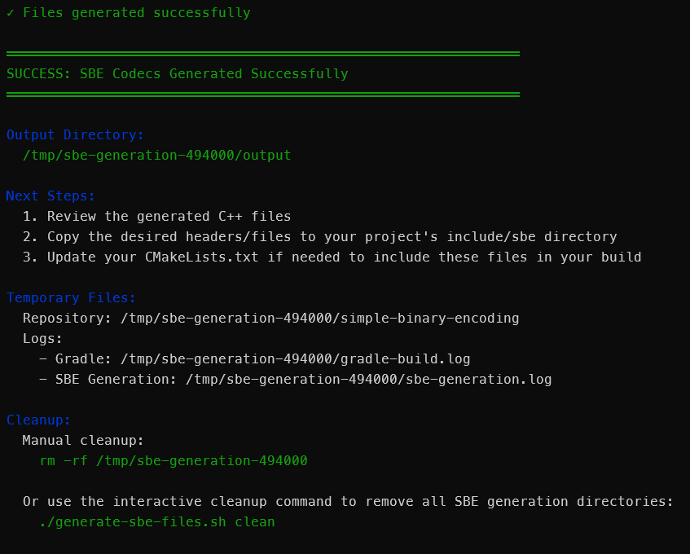

# Simple Binary Encoding (SBE) & B3 UMDF

## Overview

This directory contains **auto-generated C++ codec stubs** for encoding and decoding B3 market data messages using **Simple Binary Encoding (SBE)**.

**Do not modify these files** — they are generated from the B3 UMDF XML schema using the SBE code generation tool.

---

## Simple Binary Encoding (SBE)

**SBE** is a binary serialization format designed for low-latency, high-performance message encoding and decoding. It offers:

- **Minimal overhead**: Fixed-length headers and dense binary layout
- **High performance**: Fast encoding/decoding with minimal CPU usage
- **Schema evolution**: Built-in support for message versioning
- **Language agnostic**: Code generators available for C++, Java, C#, Go, Rust, and more

**Key characteristics:**
- Messages are encoded in **network byte order** (big-endian by default)
- No intermediate representation or deserialization overhead
- Flyweight pattern for zero-copy decoding
- Support for nested messages, groups (arrays), and variable-length data

**References:**
- [SBE Tool Guide](https://github.com/aeron-io/simple-binary-encoding/wiki/Sbe-Tool-Guide)
- [Cpp User Guide](https://github.com/aeron-io/simple-binary-encoding/wiki/Cpp-User-Guide)
- [Design Principles](https://github.com/aeron-io/simple-binary-encoding/wiki/Design-Principles)

---

## B3 UMDF (Unified Market Data Feed)

**UMDF Binary** is B3's market data distribution platform offering **low-latency binary-encoded market data** using Simple Binary Encoding (SBE).

**Benefits over FIX/FAST:**
- **Lower latency**: Optimized for encoding/decoding speed
- **Higher throughput**: Efficient binary format reduces message size
- **Standardized schema**: Vendor-independent message definitions

**UMDF feeds distribute:**
- **Instrument definitions** (security master data)
- **Incremental order book updates** (MBO - Market By Order)
- **Trade ticks** (executed transactions)
- **Snapshot recovery** (periodic full state snapshots)

**Streams:**
- **Equities (EQT)**: Stock market data
- **Derivatives (DRV)**: Futures and options market data

Each stream has multiple feeds for redundancy and load balancing (e.g., Feed A, Feed B).

**References:**
- [B3 UMDF Binary Developer Guide](https://www.b3.com.br/pt_br/solucoes/plataformas/puma-trading-system/para-desenvolvedores-e-vendors/umdf-binario/)
- [Binary UMDF - Message Specification Guidelines v2.3.1](https://www.b3.com.br/data/files/BE/B7/9F/07/C706F910CEC024F9AC094EA8/BinaryUMDF-MessageSpecificationGuidelines-v.2.3.1-enUS.pdf)
- [Binary UMDF - Message Reference v2.3.1](https://www.b3.com.br/data/files/5C/B7/2E/07/C706F910CEC024F9AC094EA8/BinaryUMDF-MessageReference-v.2.3.1-enUS.pdf)

---

## Code Generation

**The files in this directory were generated using:**

- **SBE Tool Version:** `1.40.0-SNAPSHOT`
- **B3 Market Data Messages Schema:** `2.3.1`
- **Target Language:** C++17

**The scripts:**

- Validate Java JDK installation (with platform-specific install guidance)
- Clone the SBE repository
- Build the SBE tool with Gradle
- Generate C++ codecs with proper namespace (`b3`) and Java module access configuration
- Provide cleanup functionality to remove temporary build directories

**Platforms tested:**
- Debian 13 (Linux)
- Windows 11

**Usage:**

```bash
# Linux/Unix
# Install JDK
./generate-sbe-files.sh /path/to/b3-market-data-messages-2.3.1.xml
# Copy generated files
./generate-sbe-files.sh clean  # Clean up temporary directories
```

```powershell
# Windows
# Install JDK
.\generate-sbe-files.ps1 -XmlFile "C:\path\to\b3-market-data-messages-2.3.1.xml"
# Copy generated files
.\generate-sbe-files.ps1 clean  # Clean up temporary directories
```

**Example output from successful script execution:**




**Manual Generation:**
Download the XML from [B3](https://www.b3.com.br/pt_br/solucoes/plataformas/puma-trading-system/para-desenvolvedores-e-vendors/umdf-binario/) and follow the [SBE Tool Guide](https://github.com/aeron-io/simple-binary-encoding/wiki/Sbe-Tool-Guide).
